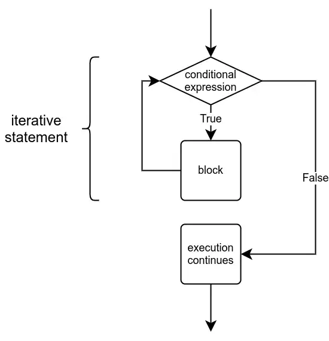

# Rapsberry Pi 
- Ran into some issues in terms of the kinds of display connectors I had access to for the Raspberry Pi 4, but I did successfully get the Raspberry Pi OS on a Raspberry Pi 3B from Canakit and was able to boot it, connect some peripherals (i.e. keyboard and mouse) and set up the basic OS settings
	
 
# MOOC coursework

## Helsinki Course: Introduction to Programming with Python
[Python Programming MOOC 2023](https://programming-23.mooc.fi/)

## Part Two
- [Part Two Lecture](https://youtu.be/xjBP3awP-I8)
- [Part Two Python Notes](/eng810/helsinki_mooc/py_notes/lecture_two.py)
- [Part Two Slides](/eng810/helsinki_mooc/written_notes/part_two.md)

### Topics Covered
- Programming terminology
	- Statement: A statement is a part of the program which executes something. It often, but not always, refers to a single command.
    - Block: A block is a group of consecutive statements that are at the same level in the structure of the program.
    - Expression: An expression is a bit of code that results in a determined data type. When the program is executed, the expression is evaluated so that it has a value that can then be used in the program.
    - Function: A function executes some functionality. Functions can also take one or more arguments, which are data that can be fed to and processed by the function. 
    - Type: Data type refers to the characteristics of any value present in the program.
    - Syntax (semantics): Similarly to natural languages, the syntax of a programming language determines how the code of a program should be written.
    - Debugging: If the syntax of the program is correct but the program still doesn't function as intended, there is a bug in the program.
- Using (len) to parse string for its length
- Floor functions in Python cause for floats to be rounded down to integers
- Python comparison operators can also be used on strings. String a is smaller than string b if it comes alphabetically before b.
	- Does require that the characters are all of the same case
- Logical operators (i.e. and / or)
- Conditionals and nested conditionals (including if, elif, & else)
- Simple loops
- Debugging print statements

## Part Three
- [Part Three Lecture](https://youtu.be/G0zdNWCm8h8)
- [Part Three Python Notes](/eng810/helsinki_mooc/py_notes/lecture_three.py)
- [Part Three Slides](/eng810/helsinki_mooc/written_notes/part_three.excalidraw)

### Topics Covered
- Functions and parameters
    - Functions are defined in this way:

    def function_name(parameter list):
        function code
- Loops with conditions

    

- Initialization refers to setting the initial value(s) of the variable(s) used within the condition of the loop; these are often called the iteration or iterator variables and they are performed before the loop is first entered
- The condition defines for how long the loop is set to be executed and is set out at the very beginning of the loop
- Updating variables means that within each repetition of the loop, the variables involved in the condition must be updated so that each iteration brings the loop one step closer to its conclusion
    
- Typical errors in constructing loops:
    - Forgetting to define how the variables will update to make progress toward the condition
- You can test looped code that would normally ask for input from a user by first "hard-coding" the input value and then using the input command later
- [Python Tutor](https://pythontutor.com/) site has a [code visualizer](https://pythontutor.com/visualize.html#mode=edit) that can be used to work through debugging issues with your code line by line
- String operations
    - Concatenation with the + operator
    - * operator can be used with a string when the other operand is an integer
    - len() returns number of characters in a string, which is always an integer value
    - As strings are essentially sequences of characters, any single character can also be retrieved -- the operator [] finds the character with the index specified within the brackets
    - You can also use negative indexing to access characters counting from the end of the string, with the last character in the string being indexed at -1
    - A substring of a string is a sequence of characters that forms a part of the string. For example, the string example contains the substrings exam, amp and ple, among others. In Python programming, the process of selecting substrings is usually called slicing, and a substring is often referred to as a slice of the string. The two terms can often be used interchangeably.
    
        If you know the beginning and end indexes of the slice you wish to extract, you can do so with the notation [a:b]. This means the slice begins at the index a and ends at the last character before index b - that is, including the first, but excluding the last.
    - Half open intervals
        - In Python string processing the interval [a:b] is half open, which in this case means that the character at the beginning index a is included in the interval, but the character at the end index b is left out. Why is that?
        
            There is no profound reason for this feature. Rather it is a convention inherited from other programming languages.
        
            Half open intervals may feel unintuitive, but in practice they do have some advantages. For example, you can easily calculate the length of a slice with b-a. On the other hand, you must always remember that the character at the end index b will not be included in the slice.
    - The in operator can tell us if a string contains a particular substring. The Boolean expression a in b is true, if b contains the substring a.
    - The operator in returns a Boolean value, so it will only tell us if a substring exists in a string, but it will not be useful in finding out where exactly it is. Instead, the Python string method find can be used for this purpose. It takes the substring searched for as an argument, and returns either the first index where it is found, or -1 if the substring is not found within the string.
- Methods
    - Methods work quite similarly to the functions covered in the previous part. What distinguishes them from functions is that methods are always attached to the object they are called on. The object is the entity named before the method in the method call. In the case of find the object is the string where the method looks for the substring it has as an argument.
- The break and continue commands

- Nested loops
    - When there are nested loops, break and continue commands only affect the innermost loop which they are a part of. 
- Functions
    - Before a function can be used, it must be defined. Any function definition begins with the keyword def, short for define. Then comes the name of the function, followed by parentheses and a colon character. This is called the header of the function. After this, indented just like while and if blocks, comes the body of the function.
    - Main functions
    - Functions often take one or more arguments, which may affect what the function does. It was mentioned before that the terms argument and parameter are often used to refer to the same thing. The distinction is that while argument is used with the data passed to the function when the function is called, inside the function the arguments are assigned to variables called parameters. So, approximately, when the function is called, we call the passed bits of data arguments, but when we are defining the function, we call them parameters.
    - It is possible to assign new variables within function definitions. The function can also see variables assigned outside it, in the main function. Such variables are called global variables. Using global variables from within functions is usually a bad idea. Among other issues, doing so may cause bugs which are difficult to trace.

## Part Four
- [Part Four Lecture](https://youtu.be/U7MFzDabDqg)
- [Part Four Python Notes](/eng810/helsinki_mooc/py_notes/lecture_four.py)
- [Part Four Slides](/eng810/helsinki_mooc/written_notes/part_four.excalidraw)

### Topics Covered
- IDEs and Visual Studio Code
- Running code with IDEs and Python interpreter
- Built-in debugger
- Parameters vs. arguments
    - A function can take one or more arguments. When the function is called, the arguments are assigned to variables, which are defined in the function definition. These variables are called parameters, and they are listed inside the parentheses after the function name.
    - The terminology around data passed to functions can feel confusing. To make matters worse, some sources refer to what we have called parameters and arguments as formal and actual parameters. Other sources call them formal and actual arguments. The Python documentation specifies only the terms argument and parameter, so that is what we will use as well.
- Function calls within function calls
- Return values
    - Functions can also return values. For instance, the built-in Python function input returns an input string typed in by the user. The value returned by a function can be stored in a variable.
    - The functions you define yourself can also return values. To do this you need the return statement.
    - The return value of a function is a value just like any other. It is not necessary to store it in a variable in order give it as an argument to the print command.
- Type hinting
- Lists
    - A Python list is a collection of values which is accessed via a single variable name. The contents of the list are written within square brackets. The values contained in the list are called items, or sometimes elements.
    - Indexing lists
    - List methods
        - append
        - insert
        - pop or remove
        - sort
        - max, min, and sum
    - Using lists with functions
- Iteration and the for loop
    - While loops can work, but they are a rather complicated way of going through a list, as you have to use a helper variable index to remember which item in the list you're at. The for loop can handle this more efficiently.
    - The idea is that the for loop takes the items in the collection one by one and performs the same actions on each. The programmer does not have to worry about which item is being handled when.

- The for loop takes an item in the collection, assigns it to the variable, processes the block of code, and moves on to the next item. When all items in the collection have been processed, execution of the program continues from the line after the loop.
- The range function
    - Often you know how many times you want to repeat a certain bit of code. You might, for example, wish to go through all the numbers between 1 and 100. The range function plugged into a for loop will do this for you.
    - There are a few different ways to call the range function. The simplest way is to give the function just one argument, which signifies the end-point of the range. The end-point itself is excluded, just like with string slices. In other words, the function call range(n) provides a loop with a range from 0 to n-1
    - The function range returns a range object, which in many ways behaves like a list, but isn't actually one. If you try printing out the value the function returns, you will only see a description of a range object
    - The function list will convert a range into a list. The list will contain all the values that are in the range. 
- Print statement formatting
    - Use of + operator for string concatenation. This method will not work if any of the segments are not strings.
    - The second method is considering each segment of the argument as a separate argument, and splitting them up with commas.
    - The third method to prepare strings is f-strings. These are incredibly versatile when used in conjunction with format specifiers.
- Global variables within functions
    - We know it is possible to assign new variables within function definitions, but the function can also see variables assigned outside it, in the main function. Such variables are called global variables.
    - Using global variables from within functions is usually a bad idea. Among other issues, doing so may cause bugs which are difficult to trace.
- Strings and lists have a lot in common, especially in the way they behave with different operators. The main difference is that strings are immutable. That means they cannot be changed.
- Count method
    - The method count counts the number of times the specified item or substring occurs in the target. The method works similarly with both strings and lists.
    - The method will not count overlapping occurrences. For example, in the string aaaa the method counts only two occurrences of the substring aa, even though there would actually be three if overlapping occurrences were allowed.
- Replace method
    - The method replace creates a new string, where a specified substring is replaced with another string